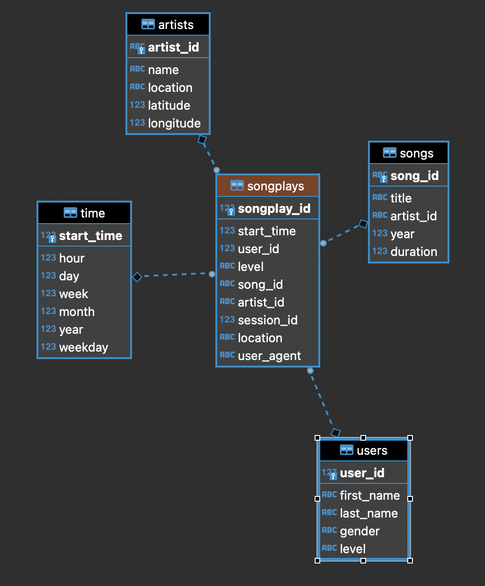

# Overview

This project build an ETL pipeline transform data in json file to relational data 

## Entity relation diagram


# Dataset
The [Million Song Dataset](http://millionsongdataset.com/) is a freely-available collection of audio features and metadata for a million contemporary popular music tracks.

# Source code files:
- test.ipynb displays the first few rows of each table to let you check your database.
- create_tables.py drops and creates tables. Run this file to reset tables before each time you run your ETL scripts.
- etl.ipynb a notebook reads and processes a single file from song_data and log_data and loads the data into tables. 
- etl.py reads and processes files from song_data and log_data and loads them into tables.
- sql_queries.py contains all sql queries, and is imported into the last three files above.

# How to run project

## Setup postgres SQL
[Postges SQL setup tutorial](https://www.tutorialspoint.com/postgresql/postgresql_environment.htm)

## Setup table data
```
python create_tables.py
```

## Run ETL process
```
python etl.py
```

